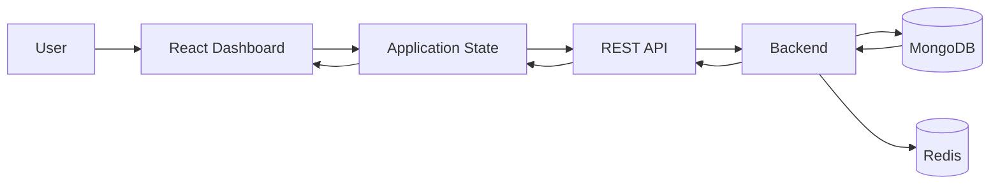
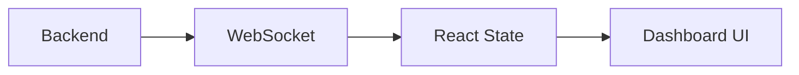

# Data Flow Diagram

## Normal API Flow



## Real-Time Flow



## Summary

```text
User
 ↓
React Dashboard
 ↓
Application State
 ↓
REST API
 ↓
Backend
 ↓
Database / Cache
 ↓
Response
 ↓
Dashboard

Real-Time:

Backend
 ↓
WebSocket
 ↓
React State
 ↓
Dashboard
```