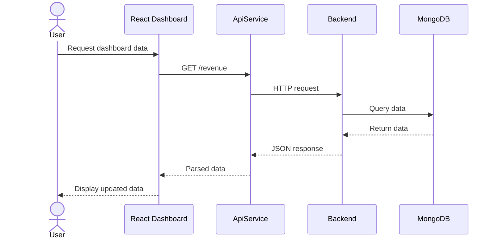
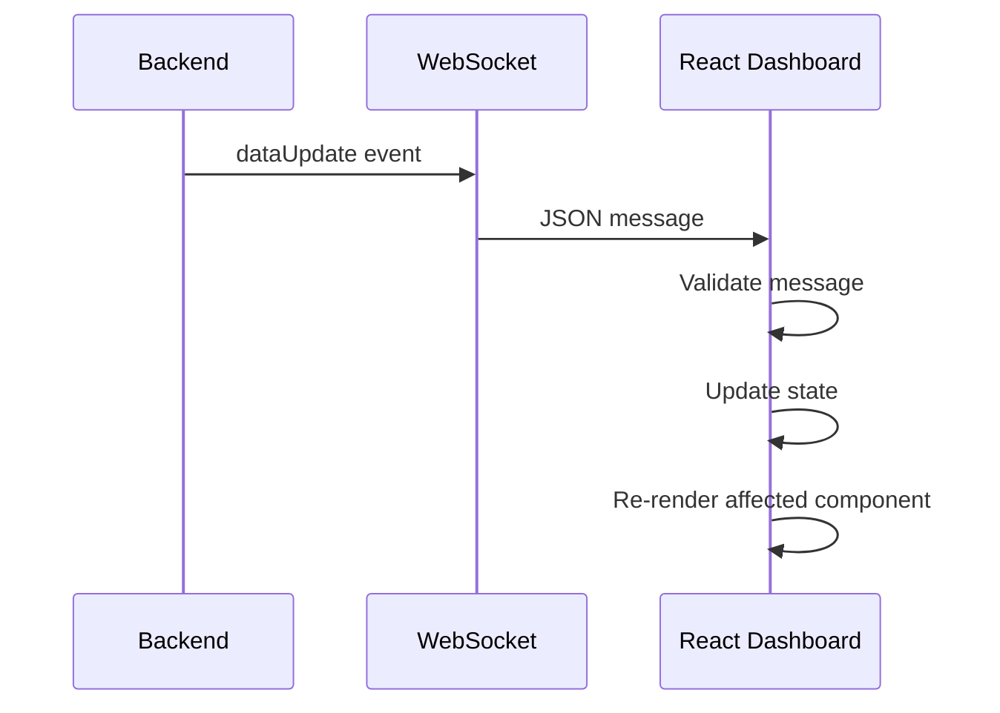
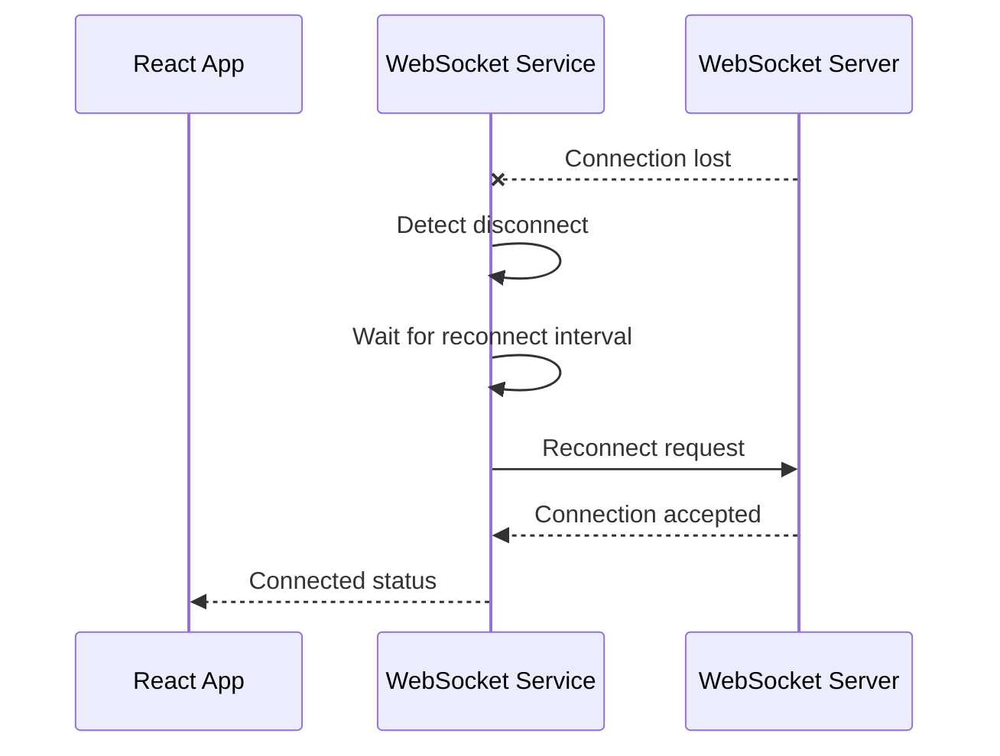

# Sequence Diagrams

## API Request

```mermaid
sequenceDiagram

    actor User

    participant UI as React Dashboard

    participant API as ApiService

    participant Server as Backend

    participant DB as MongoDB

    User->>UI: Request dashboard data

    UI->>API: GET /revenue

    API->>Server: HTTP request

    Server->>DB: Query data

    DB-->>Server: Return data

    Server-->>API: JSON response

    API-->>UI: Parsed data

    UI-->>User: Display updated data
```

## Real-Time Update

```mermaid
sequenceDiagram

    participant Server as Backend

    participant WS as WebSocket

    participant UI as React Dashboard

    Server->>WS: dataUpdate event

    WS->>UI: JSON message

    UI->>UI: Validate message

    UI->>UI: Update state

    UI->>UI: Re-render affected component
```

## Reconnection

```mermaid
sequenceDiagram

    participant UI as React App

    participant WS as WebSocket Service

    participant Server as WebSocket Server

    Server--xWS: Connection lost

    WS->>WS: Detect disconnect

    WS->>WS: Wait for reconnect interval

    WS->>Server: Reconnect request

    Server-->>WS: Connection accepted

    WS-->>UI: Connected status
```