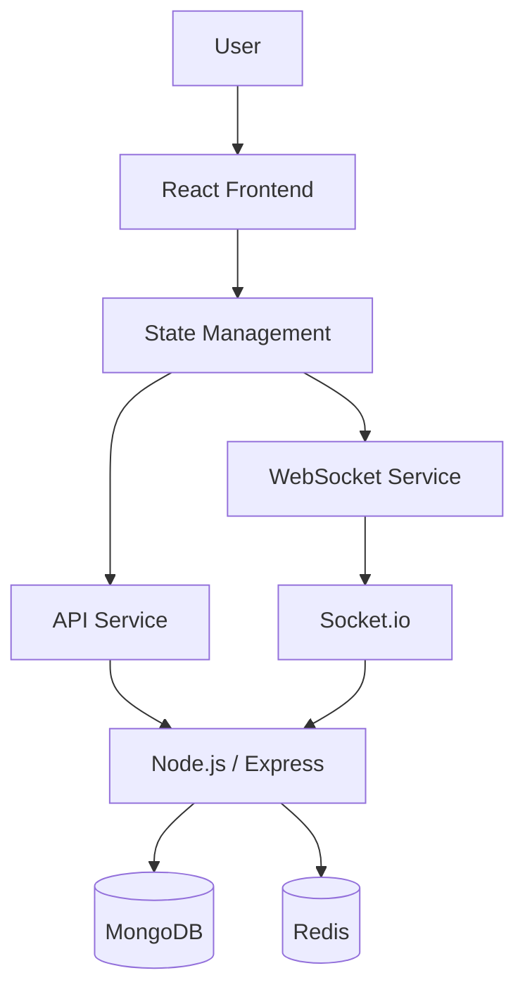

# System Architecture Diagram

## Component Relationships

| Component | Responsibility |
|---|---|
| React Frontend | User interface |
| State Management | Application state |
| API Service | REST API communication |
| WebSocket Service | Real-time communication |
| Node.js / Express | Backend processing |
| MongoDB | Persistent storage |
| Redis | Caching |
| Socket.io | Real-time events |