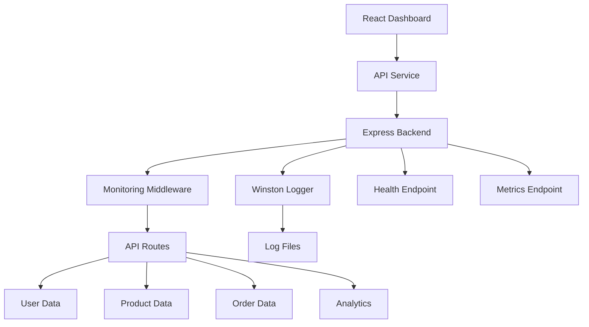

# System Architecture

## Day 14 Integration Architecture



## Request Flow

```text
User
  ↓
React Dashboard
  ↓
API Service
  ↓
HTTP Request
  ↓
Express Backend
  ↓
Monitoring Middleware
  ↓
API Route
  ↓
Data
  ↓
JSON Response
  ↓
React Dashboard
```

## Main Components

### Frontend

The React dashboard provides the user interface.

It allows the user to:

- Log in
- Load users
- Load products
- Create an order
- Load orders
- Load analytics
- Log out

### API Service

The frontend API service handles communication between the React dashboard and the Node.js backend.

It is responsible for:

- Sending HTTP requests
- Adding the access token
- Handling API responses
- Handling API errors
- Sending user requests
- Sending product requests
- Sending order requests
- Sending analytics requests

### Backend

The Node.js and Express backend provides the API endpoints.

Main API groups:

- Authentication
- Users
- Products
- Orders
- Analytics

### Authentication

The login endpoint provides an access token.

Protected API requests send the token through the `Authorization` header.

Example:

```text
Authorization: Bearer day14-demo-token
```

### Monitoring

The monitoring middleware records:

- Request method
- Request URL
- Response status
- Response time
- User agent
- Request count
- Error count
- Memory usage
- Process information

### Logging

Winston is used for application logging.

The logging system writes information to:

- Console
- `logs/combined.log`
- `logs/error.log`

### Health Check

The `/health` endpoint provides the current application health status.

Example:

```text
GET /health
```

The response contains information such as:

- Status
- Uptime
- Memory usage
- Request count
- Error rate

### Metrics

The `/metrics` endpoint provides application metrics.

Example:

```text
GET /metrics
```

The response contains:

- Memory information
- Request metrics
- Process information
- Request counts
- Request duration
- Error counts

## Data Flow

### Login Flow

```text
User
  ↓
React Login Form
  ↓
API Service
  ↓
POST /api/v1/auth/login
  ↓
Express Backend
  ↓
Authentication
  ↓
Access Token
  ↓
React Dashboard
  ↓
Token stored in localStorage
```

### Protected API Flow

```text
React Dashboard
  ↓
API Service
  ↓
Authorization Header
  ↓
Express Backend
  ↓
Authentication Check
  ↓
API Route
  ↓
Data Processing
  ↓
JSON Response
  ↓
React Dashboard
```

### Order Flow

```text
User
  ↓
Create Test Order
  ↓
React API Service
  ↓
POST /api/v1/orders
  ↓
Authentication
  ↓
Order Route
  ↓
Order Created
  ↓
JSON Response
  ↓
Dashboard
```

### Analytics Flow

```text
Dashboard
  ↓
GET /api/v1/analytics
  ↓
Express Backend
  ↓
Calculate Analytics
  ↓
JSON Response
  ↓
Dashboard
```

## Error Flow

```text
Frontend Request
  ↓
Backend
  ↓
Error
  ↓
HTTP Error Response
  ↓
API Service
  ↓
Error Message
  ↓
Dashboard
```

## Monitoring Flow

```text
Incoming Request
  ↓
Monitoring Middleware
  ↓
Start Timer
  ↓
API Route
  ↓
Response
  ↓
Calculate Duration
  ↓
Record Metrics
  ↓
Write Log
```

## Project Components

| Component | Purpose |
|---|---|
| React Dashboard | User interface |
| API Service | Frontend-backend communication |
| Express | Backend API |
| Authentication | Protect API requests |
| Monitoring Middleware | Track API requests |
| Winston | Logging |
| User Data | User information |
| Product Data | Product information |
| Order Data | Order information |
| Analytics | System statistics |
| Health Endpoint | Application health |
| Metrics Endpoint | Application metrics |

## Local URLs

### Frontend

```text
http://localhost:5173/
```

### Backend

```text
http://localhost:3014
```

### Health

```text
http://localhost:3014/health
```

### Metrics

```text
http://localhost:3014/metrics
```

## Summary

The Day 14 system connects a React frontend with a Node.js and Express backend.

The frontend sends API requests through the API service.

The backend handles authentication, users, products, orders and analytics.

Monitoring middleware records request information.

Winston records application logs.

Health and metrics endpoints provide system information.

This creates a complete frontend-to-backend integration flow.